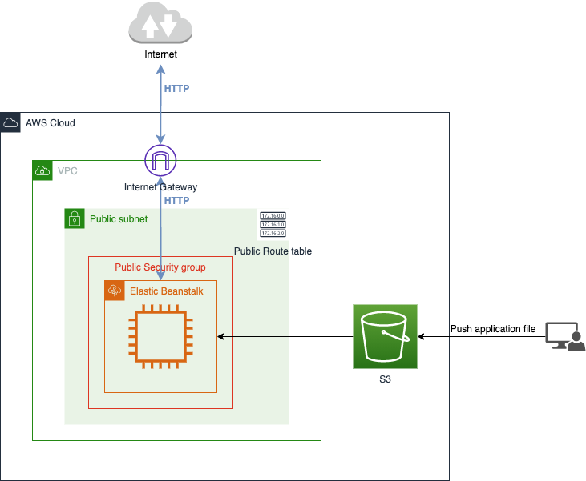
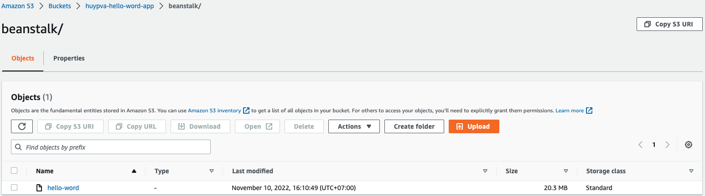
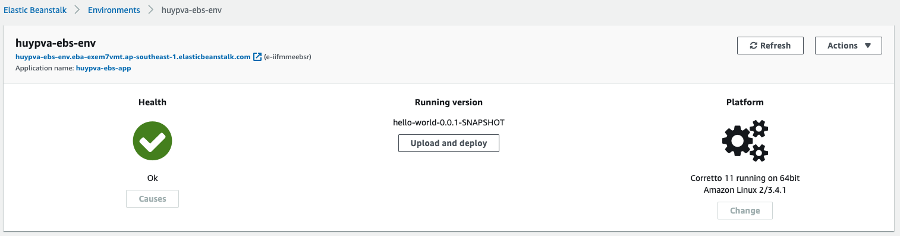

The example project for Deployment SpringBoot application on Amazon Elastic Beanstalk

<div align="center">
    
</div>

## Getting Started

## Project structure
```
.
├── hello-world/
│   ├── src
|   ├── pom.xml
│   ...
├── infrastructure
│   ├── modules/
|   │   ├── beanstalk/
|   │   ├── network/
│   │   └── s3/
│   ├── main.tf
|   ├── outputs.tf
|   └── variables.tf
└── README.md
```

## Prerequisites
- Install [AWS CLI](https://docs.aws.amazon.com/cli/latest/userguide/cli-configure-quickstart.html)

Make sure that you have a [Amazon Account](https://aws.amazon.com/account/) and configurate aws account in ~/.aws/credentials
```
[default]
aws_access_key_id=<your-key>
aws_secret_access_key=<your-key>
```

- Install [Terraform](https://learn.hashicorp.com/tutorials/terraform/install-cli)

- Install [Docker](https://docs.docker.com/engine/install/)
    
## Build spring-boot application

```shell script
$ make build
[INFO] BUILD SUCCESS
[INFO] ------------------------------------------------------------------------
[INFO] Total time:  15.346 s
[INFO] Finished at: 2022-10-20T10:04:11+07:00
[INFO] ------------------------------------------------------------------------
```

## Deploy on aws

- Initialize Terraform and the Cloudflare provider

```shell script
$ make init
```

- Apply Terraform to deploy on aws

```shell script
$ make deploy
...
Apply complete! Resources: 13 added, 0 changed, 0 destroyed

Outputs:

ebs_endpoint = "<ebs_endpoint>"
```

### Test request

Send request to your EBS endpoint 

```shell script
$ curl http://<ebs_endpoint>/greet?name=World
Hello World!
```

### Destroy resource on aws

```shell script
$ make destroy
...
Destroy complete! Resources: 13 destroyed.
```

## Resource on AWS

- [Amazon S3](https://s3.console.aws.amazon.com/) resouces

<div align="center">
    
</div>

- [Amazon Elastic Beanstalk](https://ap-southeast-1.console.aws.amazon.com/elasticbeanstalk/) resouces

<div align="center">
    
</div>

## Contributing

The code is open sourced. I encourage fellow developers to contribute and help improve it!

- Fork it
- Create your feature branch (git checkout -b new-feature)
- Ensure all tests are passing
- Commit your changes (git commit -am 'Add some feature')
- Push to the branch (git push origin my-new-feature)
- Create new Pull Request

## Reference
- https://dimitri.codes/spring-boot-terraform/

## License
This project is licensed under the Apache License v2.0. Please see LICENSE located at the project's root for more details.